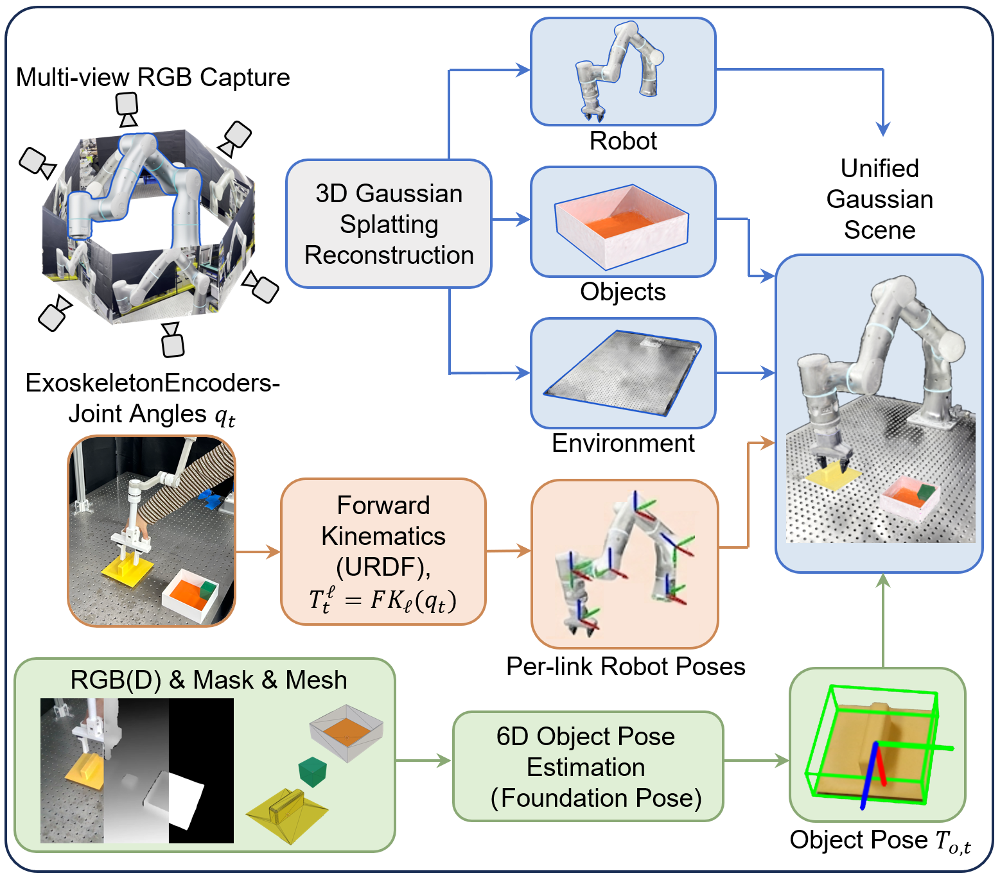
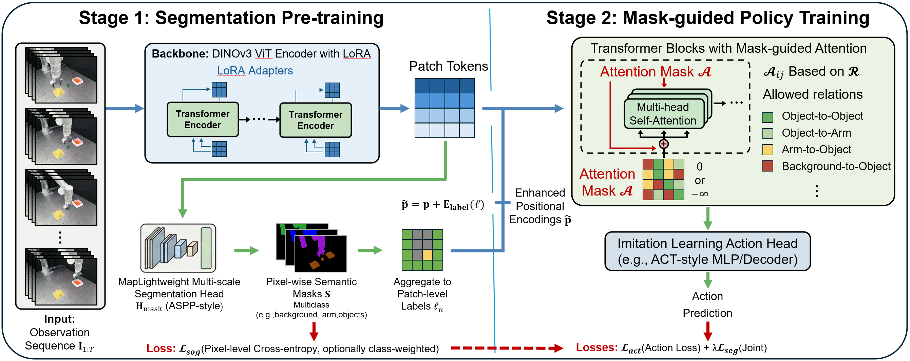

# ExoGS

<p align="center">
  
  
  
  
</p>

**ExoGS: A 4D Real-to-Sim-to-Real Framework for Scalable Manipulation Data Collection**

Yiming Wang, Ruogu Zhang, Minyang Li, Hao Shi, Junbo Wang, Deyi li, Weiming Wang, Hao-Shu Fang

ExoGS is a robotfree 4D Real-to-Sim-to-Real framework that captures both static environments and dynamic interactions in the real world and
transfer seamlessly to a simulated environment. It provides a new solution for scalable manipulation data collection and policy learning. ExoGS employs a self-designed robot-isomorphic passive exoskeleton AirExo-3 to capture kinematically consistent trajectories with millimeter-level accuracy and synchronized RGB observations during direct human manipulation. The robot, objects, and environment are reconstructed as editable 3D
Gaussian Splatting assets, enabling geometry-consistent replay and large-scale data augmentation. Additionally, a lightweight Mask Adapter injects instance-level semantics into the policy to enhance robustness under visual domain shifts. 

---

## 🌟 Highlights

- **Exoskeleton Teleoperation**: Intuitive demonstration collection using wearable exoskeleton devices
- **3D Gaussian Splatting**: High-fidelity scene reconstruction and rendering for data augmentation
- **Mask Adapter**: Lightweight semantic guidance for sim-to-real domain adaptation
- **End-to-End Pipeline**: Complete workflow from data collection to real-world deployment

---

## 📋 Table of Contents

- [ExoGS](#exogs)
  - [🌟 Highlights](#-highlights)
  - [📋 Table of Contents](#-table-of-contents)
  - [Overview](#overview)
  - [Repository Structure](#repository-structure)
  - [Installation](#installation)
    - [Prerequisites](#prerequisites)
    - [Module-Specific Installation](#module-specific-installation)
  - [Pipeline](#pipeline)
  - [Data Format](#data-format)
    - [Raw Data (CapExo Output)](#raw-data-capexo-output)
    - [Processed Data (GaussianSim Output)](#processed-data-gaussiansim-output)
    - [Training Data (HDF5)](#training-data-hdf5)
  - [Citation](#citation)
  - [Acknowledgements](#acknowledgements)
  - [License](#license)

---

## Overview

ExoGS addresses the sim-to-real gap in robot learning through a novel pipeline that:

1. **Collects** real-world demonstrations via exoskeleton teleoperation
2. **Reconstructs** scene and object assets using 3D Gaussian Splatting
3. **Augments** training data through photorealistic Gaussian rendering
4. **Learns** robust policies with a Mask Adapter that focuses on task-relevant features
5. **Deploys** trained policies on real robotic systems

**Overview of the pipeline for reconstructing manipulation demonstrations :**

<p align="center">
  
</p>

**Overview of the proposed Mask Adapter:**

<p align="center">
  
</p>

## Repository Structure

```
ExoGS/
├── CapExo/              # Data collection with exoskeleton teleoperation
│   ├── collect_data.py  # Synchronized encoder and camera data collection
│   └── postprocess.py   # Timestamp alignment and data formatting
│   
├── DataProcess/         # Data processing and annotation
│   ├── data_processor_1.py    # Frame cropping and data organization
│   ├── data_processor_2.py    # Mask backfilling
│   ├── FoundationPose/        # 6D pose estimation and tracking
│   └── X-AnyLabeling/         # Mask annotation tool
│
├── PoseProcess/         # Pose processing and post-processing
│   ├── scripts/         # Pose collection, processing, and verification
│   └── poseprocess/     # Core pose processing library
│
├── GSAssetGen/          # Gaussian model asset generation
│   ├── sapien/          # SAPIEN-based COLMAP dataset generation
│   └── scripts/         # Video to image conversion
│
├── GaussianSim/         # 3D Gaussian Splatting rendering
│   ├── gaussiansim/     # Core rendering library
│   ├── scripts/         # Rendering scripts
│   └── convert_to_train/  # HDF5 conversion for training
│
├── Mask_Policy/         # Policy learning with Mask Adapter
│   ├── maskpolicy/      # Mask policy implementation
│   └── train/           # Training configurations and scripts
│
└── CmdExo/              # Real robot deployment
    ├── rollout.py       # Hardware control node
    └── inference.py     # Policy inference node
```

---

## Installation

### Prerequisites

  - Intel RealSense D415 camera
  - Flexiv Rizon robot arm (for deployment)
  - Xense gripper (for deployment)
  - Exoskeleton device (for data collection)

### Module-Specific Installation

Each module has its own environment to avoid dependency conflicts. Please refer to the README in each module directory for detailed installation instructions.

---

## Pipeline

**Pipeline Flow:**

```
  CapExo
     ↓
DataProcess
     ↓
PoseProcess   GSAssetGen
     ↓            ↓               
      GaussianSim
           ↓
      Mask_Policy
           ↓
      CmdExo
```

---

## Data Format

### Raw Data (CapExo Output)
```
<timestamp>/
├── encoder/
│   ├── angle.npy
│   └── timestamps.npy
└── camera/
    ├── color/
    ├── depth/
    ├── timestamps.npy
    └── intrinsics.txt
```

### Processed Data (GaussianSim Output)
```
GSData/
└── records_xxxx/
    └── record_xxxx/
        ├── angles/          # Robot joint angles
        ├── tcps/            # TCP poses
        └── cam_0/
            ├── rgbs_bg0/    # RGB images
            ├── depths/      # Depth maps
            ├── masks/       # Segmentation masks
            └── masks_clean_labels/
```

### Training Data (HDF5)
```
data/
├── demo_0/
│   ├── images   (N, H, W, 3) uint8
│   ├── masks    (N, H, W, 3) uint8
│   ├── joints   (N, num_joints) float64
│   └── tcps     (N, 10) float64
└── demo_1/
    └── ...
```

---

## Citation

If you find this work useful, please cite:

```bibtex
@article{exogs2026,
  title={ExoGS: A 4D Real-to-Sim-to-Real Framework for Scalable Manipulation Data Collection},
  author={Yiming Wang, Ruogu Zhang, Minyang Li, Hao Shi, Junbo Wang, Deyi Li, Weiming Wang, Hao-Shu Fang},
  year={2026}
}
```

---

## Acknowledgements

This project builds upon several excellent open-source projects:

- [3D Gaussian Splatting](https://github.com/graphdeco-inria/gaussian-splatting) - 3D scene reconstruction
- [FoundationPose](https://github.com/NVlabs/FoundationPose) - 6D pose estimation and tracking
- [X-AnyLabeling](https://github.com/CVHub520/X-AnyLabeling) - Auto labeling tool
- [LeRobot](https://github.com/huggingface/lerobot) - Robot learning framework
- [SAPIEN](https://sapien.ucsd.edu/) - Physics simulation
- [COLMAP](https://github.com/colmap/colmap) - COLMAP format dataset generation
- [r3kit](https://github.com/dadadadawjb/r3kit) - Robot control toolkit

---

## License

This project is licensed under the MIT License - see the [LICENSE](LICENSE) file for details.

Individual modules may have additional licensing terms. Please check the README or LICENSE file in each module directory.

